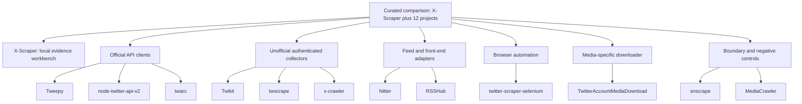

# X-Scraper

[](https://github.com/Alex-lop/X-Scraper/actions/workflows/ci.yml)

<p align="center">
  
</p>

X-Scraper turns a small, human-approved X capture into a durable local snapshot for inspection,
export, and bounded read-only agent access.

`X-Scraper` is the product and repository, `x-collection-workbench` is the Python package, and
`xworkbench` is its command-line program. This recovery build is experimental: its production
parser is proven against local Chromium fixtures, but no live X capture is owner-verified yet.

> **Future demo GIF:** insert the sanitized recording described in [docs/demo.md](docs/demo.md)
> only after every storyboard dependency passes. No live footage or broken placeholder is shipped.

## What you can do

- Approve one bounded capture or an exact saved-source batch, preserving available Posts,
  provenance, partial results, and stop reasons in local SQLite.
- Inspect, search, and export a saved snapshot without making another X request.
- Let a local MCP client read terminal snapshots through bounded, read-only tools.
- Operate setup, capture approval, and the durable queue from an optional local terminal UI.

## Try safely in 60 seconds

From a clean checkout with Python 3.11-3.13, activate a virtual environment and run:

```bash
python -m pip install -e '.[browser,mcp,dev]'
xworkbench setup
xworkbench demo
# Press Ctrl+C after exploring, then:
xworkbench start
```

The demo opens a loopback dashboard with two compatible 25-Post snapshots about a clearly fictional
topic, uses a temporary database, and cannot collect from X. `start` opens the persistent workbench.

For reproducible lock-based installation and Windows PowerShell commands, see
[Getting started](docs/getting-started.md). This project is installed from source; no PyPI release
is claimed.

## Real capture quickstart

Only proceed when you are authorized to access the content and have obtained any permission X's
terms require.

```bash
python -m playwright install chromium
xworkbench auth
xworkbench doctor
xworkbench start
```

`auth` opens a fresh headed Chromium context for normal manual sign-in; the program never asks for
your password. In the loopback dashboard, preview a Browser capture, review the exact source and
1-25 Post budget, then confirm it. Stop on login, challenge, rate limit, or other manual action;
the application does not bypass those states. See [Browser capture](docs/browser-capture.md).

For several sources, save each source first, select 2-25 in **Capture several saved sources**, then
preview and confirm the unchanged server manifest. There is no capture or batch CLI shortcut.

The official X API provider is optional and separately requires a token, an exact preview, and
paid-read confirmation. Its compiler and response mapper are proven only with synthetic data; see
[Official X API](docs/official-x-api.md).

For keyboard-first local operations, install `.[tui]` and run `xworkbench tui`. Attach a read-only
second terminal with `xworkbench monitor`; see [Terminal operations](docs/terminal-operations.md).

## Connect one local MCP client

Codex documents this stdio registration form:

```bash
codex mcp add xworkbench -- xworkbench mcp
codex mcp list
```

`xworkbench mcp` reads configured SQLite directly without starting the dashboard. The repository
proves the MCP 2.0 stdio server against the real SDK and local storage, but has not
yet recorded an end-to-end Codex client session. Tool bounds and that distinction are documented in
[MCP](docs/mcp.md).

## Capabilities and limits

| Surface | Current evidence | Important limit |
| --- | --- | --- |
| Offline demo | Proven offline | Two synthetic 25-Post snapshots, Changes/search/export, and a real local MCP read |
| SQLite evidence/Changes/export | Proven offline | Freshness is descriptive; reuse and retention are never automatic |
| Bounded saved-source batch | Proven offline | UI only; atomic admission; two is a global mixed-provider ceiling, while same-provider Browser and official jobs remain effectively serial |
| Browser capture | Proven local Chromium | Sanitized local fixtures only; live X remains owner-gated |
| Official X API | Proven offline | Synthetic compiler/mapper tests only; no paid live request |
| MCP | Proven offline | Direct read-only SQLite by default; no collection or X writes |
| Live X acceptance | Not yet verified | Session, current DOM, challenge, and rate-limit outcomes are unknown |

## How X-Scraper compares



| Project | Product shape | X surfaces | Queue/resume | Storage/output | Operator UX | Current evidence | Candid verdict |
| --- | --- | --- | --- | --- | --- | --- | --- |
| X-Scraper | Local Python evidence workbench | Browser Home/profile/Latest search; official profile/search | Durable bounded queue, leases, cancellation, restart recovery | SQLite snapshots, JSON/CSV, search/Changes, read-only MCP | Web, CLI, optional terminal UI | `SOURCE PRESENT`; local dashboard/TUI and Chromium gates pass; exact-head hosted CI is pending; live X is `LIVE NOT RUN` | `LIMITED`: strong offline approvals, queue, SQLite evidence, MCP, and local dashboard/TUI coverage; live X, Windows, external MCP, and Browser process-tree governance remain unverified; Browser concurrency is 1 |
| [Tweepy](https://github.com/tweepy/tweepy) | Python official-API library | Broad documented REST and streaming clients | Caller-owned pagination/rate-limit handling | Returned Python models; caller-owned storage | Library | `REPO FACT`; `PROJECT CI`; live use here is `LIVE NOT RUN` | `OFFICIAL REFERENCE`; do not add it unless the existing transport reaches a measured limitation |
| [node-twitter-api-v2](https://github.com/PLhery/node-twitter-api-v2) | TypeScript official-API client | v1.1/v2 REST, streaming, pagination | Client helpers; caller-owned durability | Returned objects/streams; caller-owned storage | Library | `REPO FACT`; `SOURCE PRESENT`; live use here is `LIVE NOT RUN` | `OFFICIAL REFERENCE`; useful design evidence, but wrong runtime for this Python product |
| [twarc](https://github.com/DocNow/twarc) | Python collection CLI/library | Official API v2 archive/search and hydration workflows | Pagination and restart-oriented files | JSON Lines and plugins | CLI/library | `UPSTREAM-DOCUMENTED`; `CONTRADICTED` by upstream support notice | `HISTORICAL ONLY`; upstream says it is unsupported after quota changes |
| [Twikit](https://github.com/d60/twikit) | Python unofficial authenticated client | Claimed timeline, search, user, trend, and interaction surfaces | Client pagination; no equivalent durable evidence queue shown | Returned models; caller-owned storage | Library | `SOURCE PRESENT`; independent live acceptance is `LIVE NOT RUN` | `RESEARCH ONLY`; broad undocumented-interface claims without independent live proof |
| [twscrape](https://github.com/vladkens/twscrape) | Python async unofficial collector | Search, users, timelines, lists, trends, and related objects | Built-in multi-account pool and pagination | JSON/model output; account database | CLI/library | `SOURCE PRESENT`; architecture conflicts with this product boundary | `DO NOT ADOPT`; account-pool architecture conflicts with the single-identity boundary |
| [Nitter](https://github.com/zedeus/nitter) | Self-hosted service/front-end | Profiles, timelines, search, threads, RSS | Service cache/rate-limit behavior; not an ingestion resume queue | HTML/RSS service output | Web service | `REPO FACT`; `PROJECT CI`; external instance behavior is `LIVE NOT RUN` | `DESIGN REFERENCE`; a service/frontend, not an evidence-ingestion SDK |
| [snscrape](https://github.com/JustAnotherArchivist/snscrape) | Python scraping CLI/library | User/search/list/hashtag-era collectors | Iterators only; caller-owned durability | JSONL/CLI or Python objects | CLI/library | `REPO FACT`; stale source plus continuing X failures are `CONTRADICTED` | `REJECT`; stale and contradicted by continuing X failure reports |
| [twitter-scraper-selenium](https://github.com/shaikhsajid1111/twitter-scraper-selenium) | Python Selenium application | Search/profile-oriented browser collection | Source-present progress/checkpoint behavior is limited | CSV/JSON-oriented exports | CLI/script | `SOURCE PRESENT`; current independent acceptance is `LIVE NOT RUN` | `RESEARCH ONLY`; recent source activity but no current live acceptance evidence |
| [RSSHub](https://github.com/DIYgod/RSSHub) | TypeScript feed-generation service | Current X user/list/search-style routes | Service caching; no durable evidence resume queue | RSS/Atom/JSON feed delivery | Web service/routes | `SOURCE PRESENT`; route availability is not durable capture proof | `DESIGN REFERENCE`; current X route source, but feed delivery is not durable evidence storage |
| [MediaCrawler](https://github.com/NanmiCoder/MediaCrawler) | Multiplatform research crawler | No X adapter in the pinned source | Platform-specific task flows | Local files/databases depending on adapter | CLI/web-oriented tooling | `REPO FACT`; custom license is `CONTRADICTED` with permissive reuse | `NO X / LICENSE-LIMITED`; architecture reference only, with a custom noncommercial license |
| [x-crawler](https://github.com/wjzdw007/x-crawler) | Chinese-language X data project | Claimed X collection/data updates | No proven durable operator queue equivalent | Repository data/files | Scripts/repository workflow | `REPO FACT`; frequent data commits do not prove collector maintenance | `WATCH ONLY`; operational data churn is not equivalent to core maintenance |
| [TwitterAccountMediaDownload](https://github.com/JDDKCN/TwitterAccountMediaDownload) | Chinese/English media downloader | Account media download | Resume-oriented download workflow | Local media and metadata | Desktop/CLI-style application | `SOURCE PRESENT`; current compatibility is `LIVE NOT RUN` | `NICHE REFERENCE`; useful media/resume UX, stale compatibility and limited platform proof |

The detailed, dated claim ledger is [Competitor landscape](docs/competitor-landscape.md). No
competitor was installed or run against X; repository activity and stars are context, not quality
scores or live-acceptance evidence.

## Documentation

- [Getting started](docs/getting-started.md)
- [Browser capture](docs/browser-capture.md)
- [Official X API](docs/official-x-api.md)
- [Storage and cache semantics](docs/storage-and-cache.md)
- [MCP](docs/mcp.md)
- [Terminal operations](docs/terminal-operations.md)
- [Configuration](docs/configuration.md)
- [Testing and evidence](docs/testing.md)
- [Demo and recording storyboard](docs/demo.md)
- [Responsible use](docs/responsible-use.md)
- [Roadmap](docs/roadmap.md)
- [Competitor landscape](docs/competitor-landscape.md)
- [Contributing](CONTRIBUTING.md)
- [Verification record](docs/verification.md), [provider ADR](docs/adr/0001-feed-to-context-providers.md), and [queue ADR](docs/adr/0002-bounded-capture-queue.md)

Generated state stays under the ignored `var/` directory by default. Treat Bearer Tokens and
Playwright storage state as secrets: never commit, paste, attach, or include them in diagnostics.

## License and use boundary

The code is MIT licensed; MIT permits commercial use. The operational boundary below is a project
safety rule and a summary of current platform terms, not a change to that license or legal advice.

> Intended for bounded personal research and local experimentation on content you are authorized to access. [X's current Terms](https://x.com/en/tos) prohibit scraping without prior written permission, regardless of commercial intent. Do not use this project for evasion, fraud, abuse, private-data collection, or commercial-scale harvesting.
