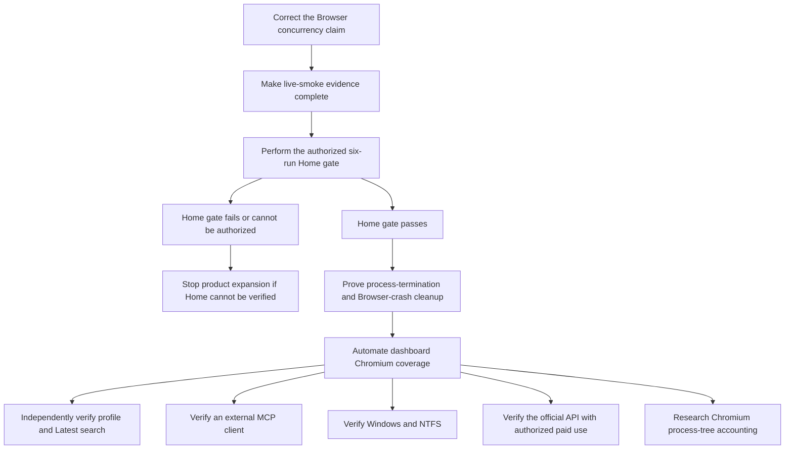

# X-Scraper Recovery Postmortem — What Worked, What Failed, and What Still Isn’t Real

> [!WARNING]
> **60-second verdict:** the recovery produced a well-defended offline product and a credible local-Chromium test system. Its essential live-X interaction is still not verified. Worse, the published 2.415× two-worker Browser interpretation is not reachable through the production API and is therefore **MISLEADING**.

> [!CAUTION]
> This is a historical handoff, not a replacement for the mutable [verification record](docs/verification.md). “Mean” here means unsparing about defects, process, and unsupported claims. It does not mean contempt for contributors.

## Snapshot metadata

| Reference | Value |
| --- | --- |
| Evidence date | `2026-08-19` recovery; Actions conclusions re-queried `2026-08-20T04:16:10Z` |
| Baseline | [`ab93ba7f02c9c82fff87d82be583090fa8a6c1f5`](https://github.com/Alex-lop/X-Scraper/commit/ab93ba7f02c9c82fff87d82be583090fa8a6c1f5) |
| Final pre-guide implementation/CI boundary | [`1bd21ea9d0c7766b9440b65891569260ed92e5f3`](https://github.com/Alex-lop/X-Scraper/commit/1bd21ea9d0c7766b9440b65891569260ed92e5f3) |
| Documentation tip reviewed here | [`3195a29c1bf843e4af91c6544cad9a694a61cfa5`](https://github.com/Alex-lop/X-Scraper/commit/3195a29c1bf843e4af91c6544cad9a694a61cfa5) |
| Postmortem checkpoint | The commit that introduces this file, titled `docs: add candid recovery postmortem`; resolve it with `git log --diff-filter=A -1 --format=%H -- RECOVERY_POSTMORTEM.md` |
| Recovery range | 36 commits **after** the baseline; 37 revisions if the baseline itself is counted |
| Endpoint diff | 59 files changed, `+18,727/-1,120` from `ab93ba7` to `3195a29`; this is net endpoint change, not cumulative churn |
| Final recorded local gate | 200 passed, 32 skipped; JavaScript 6/6; hardened capability lab 30 passed and one macOS-only skip, three times |
| Documentation-tip CI | [Run 32231296633](https://github.com/Alex-lop/X-Scraper/actions/runs/32231296633): Python 3.11–3.13 each 195 passed/32 skipped and JavaScript 6/6; Browser 5 passed plus matrix 1 passed/1 deselected; capability lab 31 passed three times |

A Git commit cannot embed its own object ID because changing the file changes the object ID. The postmortem row therefore identifies the introducing commit without inventing a self-SHA; the exact SHA belongs in the publication report and Git history.

## Status vocabulary

| Label | Meaning in this document |
| --- | --- |
| `PROVEN` | Reproducible evidence passed inside the exact stated boundary. |
| `LIMITED` | Evidence is real but narrower than the product claim someone may be tempted to make. |
| `NOT VERIFIED` | The necessary evidence is absent, incomplete, platform-specific, or not current. |
| `MISLEADING` | The underlying observation may be real, but its advertised interpretation is false or unsupported. |

Documentation-tip CI is green. That matters. It proves that integrated tip, not that the route to it was disciplined or that this postmortem's future push will pass. The recovery also produced six failed runs, three cancelled installer stalls, eight commits without their own head-SHA run, multiple oversized commits, and a benchmark conclusion that crossed its evidence boundary.

## Outcome scorecard

| Surface | Before | Now | Evidence | Remaining risk |
| --- | --- | --- | --- | --- |
| Installation | A 13-package lock omitted Browser/MCP dependencies; CI resolved extras and installed Chromium in every Python job. | 46-package universal lock, pinned build backend, inspected wheel, Linux 3.11–3.13 matrix, archived macOS clean install. | `PROVEN` offline; [setup record](docs/getting-started.md) and [verification](docs/verification.md). | `LIMITED`: no hashes, no PyPI release, no Windows clean install, mutable Action tags. |
| Browser capture | Home-only; fake lifecycle coverage; production selectors/projection never ran in real Chromium. | Five production-path local-Chromium cases cover projection, exact target, stalls, virtualization, cleanup, and derived Home/profile/Latest-search destinations. | `LIMITED`; [Browser evidence](docs/browser-capture.md) and [testing](docs/testing.md). | Live X acceptance, selectors, order, completeness, session longevity, locale drift, and authorization remain `NOT VERIFIED`. |
| Storage | Schema v2 and a 717-line module with weak transition/migration validation. | Schema v4, atomic checkpoint/Post writes, protected v1–v3 migrations, FTS, Changes, exports, explicit purge, corruption isolation. | `PROVEN` offline; [storage contract](docs/storage-and-cache.md). | Purge is logical deletion, not byte erasure; migration backups require operator care. |
| Queue | A 201-line single-worker service without the recovered durable batch contract. | Durable admission, priority/FIFO/source fairness, leases, recovery, idempotency, cancellation, progress, backpressure, resource admission. | Core queue behavior `PROVEN` offline; [ADR 0002](docs/adr/0002-bounded-capture-queue.md). | Browser two-worker interpretation is `MISLEADING`; crash/process-death cleanup and whole-browser resource limits are unproved. |
| MCP | Legacy loopback-oriented reads and no real SDK recovery gate. | Direct query-only SQLite plus legacy adapter; real MCP 2.0 stdio discovers 12 tools and one resource template. | `PROVEN` offline; [MCP record](docs/mcp.md). | No Codex, Claude/Claude Code, Cursor, or other external-client call is verified. |
| UI | A basic snapshot dashboard with claims that could outrun sparse Browser fields. | Source workspace, batch preview/confirm, progress, Changes, evidence search/export, snapshot deletion, and agent panels. | `LIMITED`; JavaScript tests and recorded [demo QA](docs/demo.md). | No automated dashboard Chromium E2E in CI; the recorded render is not continuous coverage, and an explicit retention-policy UI remains future work. |
| Demo | A temporary synthetic demo existed but did not demonstrate the recovered research loop. | Deterministic two-snapshot, 50-Post loop proves 10/15/10 Changes, literal search, JSON/CSV export, and direct MCP comparison. | `PROVEN` offline; [demo record](docs/demo.md). | It proves no live X behavior and no external MCP client. |
| Capability lab | Absent. | 2,024 lines and 31 fixed-fixture tests under a triple-run isolated Linux gate. | `LIMITED`; [disposition matrix](docs/capability-lab.md). | It is test-only, costly, and proves none of its production analogues. Freeze expansion. |
| Documentation | README and historical ADR 0001 carried broad or stale interpretations. | A full operator, safety, testing, verification, architecture, and roadmap set. | `PROVEN` as a documented snapshot; [documentation map](#canonical-evidence-map). | Counts, pricing, dependency state, and client commands decay; ADR 0001 already contradicts implemented profile/search support. |

The repository is useful now. It can be installed, exercised without X, inspected, queried, demonstrated, and tested with local Chromium. That is a real recovery. It is not the same thing as proving the product’s defining live interaction.

## Complexity blast radius

| Concentration | Current lines | Recovery-range delta | Risk |
| --- | ---: | ---: | --- |
| `xworkbench/storage.py` | 3,017 | `+2,500/-200` | Schema, migration, queue, evidence, purge, and connection behavior are concentrated in one failure domain. |
| `xworkbench/api.py` | 1,800 | `+1,272/-67` | Request trust, approval, presentation, and orchestration are tightly coupled. |
| `xworkbench/jobs.py` | 1,229 | `+1,103/-75` | Scheduling, lifecycle, resource admission, progress, and persistence callbacks share state. |
| `xworkbench/read_service.py` | 929 | `+929/-0` | A new bounded query surface arrived in one commit with no prior operational history. |
| `xworkbench/static/app.js` | 1,299 | `+657/-17` | A large stateful UI is covered mostly below full browser E2E. |
| Capability lab | 2,024 | `+2,024/-0` | A test-only subsystem is large enough to become a product in disguise if allowed to grow. |

These six concentrations total 10,298 lines, roughly 45% of tracked Python/JavaScript. The 18,727 additions are maintenance cost, not an achievement badge. Large diffs were sometimes necessary; they still increase review blind spots and regression surface.

> [!CAUTION]
> Freeze capability-lab expansion. Do not start a speculative decomposition of these hotspots either. Refactor only when a measured defect identifies the seam, then take the smallest root-cause change.

## Complete failure ledger

“Recovery” below means a regression check exists for the stated local boundary. It does not upgrade an offline result into live-X proof.

### Product, storage, and lifecycle failures

| Status | Symptom | Root cause | Why it escaped | Recovery and proof | Remaining recurrence risk |
| --- | --- | --- | --- | --- | --- |
| `PROVEN` | Post-terminal writes were possible and cancellation could lose a terminal race. | Storage transitions did not centrally reject immutable/cancelled states. | Happy-path provider tests asserted final rows, not hostile transition order. | [`af7c7ab`](https://github.com/Alex-lop/X-Scraper/commit/af7c7ab07e354e75501b1bf090b729f0fb127d97) added atomic transition and cancellation-precedence tests. | A future write path that bypasses storage invariants can re-open it. |
| `PROVEN` | SQLite/integrity callback failures could be swallowed, mislabeled `browser_unavailable`, and invalidate a usable session. | A broad Browser exception boundary owned both provider and persistence failures. | Tests injected navigation/parser failures, not callback failure at the ownership boundary. | [`79c796c`](https://github.com/Alex-lop/X-Scraper/commit/79c796cc6e47587caa0a75eb9ab2b3063704d094) and [`a7846c1`](https://github.com/Alex-lop/X-Scraper/commit/a7846c19035e166e3ef8fdf4158e319176b39eac) separate, sanitize, and test storage callback errors. | New callbacks or broader catches remain dangerous. |
| `PROVEN` | Schema validation accepted structurally wrong databases. | Version/family checks did not fully validate expected tables, columns, indexes, and foreign keys. | Migration tests focused on version movement, not lookalike drift. | `af7c7ab` added key/index drift rejection, protected backups, rollback, and exact compatible-version tests. | Future schema changes need exact validator and migration updates together. |
| `PROVEN` | Nonprivate or malformed Browser state and missing or corrupt verification markers could be reported ready, allowing an impossible Browser preview/submission. | Missing/corrupt marker data defaulted to ready, and request preparation did not independently enforce readiness. | Fixtures used well-formed, app-owned state and markers. | [`a7846c1`](https://github.com/Alex-lop/X-Scraper/commit/a7846c19035e166e3ef8fdf4158e319176b39eac) binds readiness to private app-owned state, validates marker shape/digest, and rejects unusable preparation. | No current live session acceptance is proven; new marker fields must fail closed without crashing preview. |
| `PROVEN` | Malformed job JSON or unknown persisted providers could crash or poison unrelated work. | Queue deserialization trusted durable values too early and workers treated one corrupt row as global failure. | Fixtures wrote only valid application-generated jobs. | `af7c7ab`, `79c796c`, and [`e3771e2`](https://github.com/Alex-lop/X-Scraper/commit/e3771e2cffdab165e77721f2b8d1e0c1fc26c950) added row-local corruption and next-job survival tests. | SQLite files remain user-modifiable; every new scalar/JSON field must stay fail-local. |
| `PROVEN` | Raw exception and credential-shaped contents could reach logs or durable error text. | Generic exception formatting crossed the public/log boundary. | Tests checked status codes, not adversarial message contents. | `79c796c` added secret-sentinel log/job tests and stable generic errors; [`1caa754`](https://github.com/Alex-lop/X-Scraper/commit/1caa7546f87e996e4401f67e71e7d4bb16511288) recursively allowlisted API output. | New diagnostics and third-party exceptions must remain sanitized. |
| `PROVEN` | Corrupt numeric/boolean queue scalars could crash readers and workers. | Durable scalars were cast as if SQLite rows were trusted typed objects. | Corrupt JSON was tested earlier; scalar mutation was not. | `e3771e2` added generic, row-local corrupt-scalar tests. | Every new persisted scalar expands this parser boundary. |
| `PROVEN` | Migration/version contracts drifted and backups could be overwritten or misrepresented. | Migration acceptance was broader than the actually supported source schema and backup lifecycle. | Tests used clean current fixtures, not collision, corruption, and rollback cases. | `af7c7ab` restricts compatible versions, creates mode-private backups before writes, rejects collisions, and proves rollback. | Backups are intentionally retained; operators can still mishandle them. |
| `PROVEN` | Restarted capture looked like one continuous viewport; segment provenance drifted. | Resume reused durable progress without making the new attempt an explicit segment. | Deduplication was tested, provenance continuity was assumed. | `af7c7ab` increments capture segments; `a7846c1` emits segment/observation telemetry. | Process-death recovery is still simulated, not killed end to end. |
| `PROVEN` | Browser telemetry omitted coverage/drift details, and view counts were lost while some compact metrics failed parsing. | DOM projection and metadata did not preserve all observed metric/evidence states. | Fake locators reflected the expected schema instead of real DOM-shaped fixtures. | `a7846c1` plus [`df8fca5`](https://github.com/Alex-lop/X-Scraper/commit/df8fca59c772f7af01d43850524137c7085f366a) add coverage, view/quote handling, compact-metric fixtures, drift reports, and real local Chromium. | Current live-X DOM, locale variants, and virtualization behavior remain `NOT VERIFIED`; only the local virtualized fixture is proven. |
| `LIMITED` | Deadline and cancellation checks happened only between blocking Browser calls. | Synchronous Playwright calls cannot be pre-empted safely mid-call. | Unit fakes returned immediately, hiding the native-call ceiling. | `a7846c1` bounds launch/navigation/waits and polls cancellation every 100 ms. | A wedged native call is still not interruptible; process-level termination is unproved. |
| `PROVEN` | The initial batch implementation needed protection against approval/order mismatch and partial admission. | Approval, canonicalization, and admission were not yet one exact transaction-bound contract. | Single-job confirmation did not exercise multi-item order, expiry, rollback, or idempotency. | [`8a1d946`](https://github.com/Alex-lop/X-Scraper/commit/8a1d9463abb6417aed61f979cb34df84787c370a), [`0831481`](https://github.com/Alex-lop/X-Scraper/commit/083148179cb6a5b2f8281198a686fd3758c1d466), and [`5d81417`](https://github.com/Alex-lop/X-Scraper/commit/5d81417962145fc7505b03acc0816f34973d79bc) add canonical preview, exact confirm, atomic admission, rollback, and scoped cancellation. | The newly found Browser concurrency claim proves route-level semantics still need direct tests. |
| `PROVEN` | Terminal progress could be asserted before the terminal event entered the buffer. | Durable status and in-memory event emission were observable on different schedules. | The timing passed on Python 3.12/3.13 and failed only on 3.11 CI. | [`672beb7`](https://github.com/Alex-lop/X-Scraper/commit/672beb7ed2a966a1aa82275c8d93fefd47b07971) waits for the terminal sequence; its push run was green. | Any new asynchronous observer needs durable-state fallback. |
| `PROVEN` | Repeated SQLite connection contexts leaked file descriptors. | Python's SQLite connection context manager commits or rolls back but does not close; the repository needed an explicit closing connection wrapper. | Normal limits tolerated the leak; short suites did not exhaust descriptors. | `e3771e2` introduced `_ClosingConnection` and low-FD checks; [`62de21c`](https://github.com/Alex-lop/X-Scraper/commit/62de21cc414544a7b76dd8f89029d5c5ae61e42b) later proved direct MCP reused the fixed lifecycle under repetition. | Platform FD behavior differs; keep the low-limit gate. |
| `PROVEN` | Concurrent SQLite open/close could deadlock or race. | The custom connection lifecycle was not serialized across writer and read-only polling threads. | Sequential low-FD tests missed concurrent constructor/destructor behavior. | [`acd4204`](https://github.com/Alex-lop/X-Scraper/commit/acd42045cc777400a6962879c193c4fb4a9c6c1d) adds an `RLock` at the shared lifecycle and a subprocess stress test. | The global lock limits throughput; split only if measurement proves it matters. |
| `PROVEN` | Offline setup failed when Chromium was absent, blocking the very demo meant to work offline. | `setup` reused strict `doctor` semantics without distinguishing capture prerequisites. | Development machines already had Chromium. | [`5d37b93`](https://github.com/Alex-lop/X-Scraper/commit/5d37b9396ed5318a383497ce2ba5aa18b89bf263) makes missing Chromium a setup warning while keeping standalone doctor/capture strict. | Packaging/install paths still need Windows proof. |
| `PROVEN` | Browser profile/search snapshots were labeled “Browser Home.” | UI metadata hard-coded the original single Browser surface. | Unit fixtures were Home-centric; new surfaces arrived later. | [`2724e6b`](https://github.com/Alex-lop/X-Scraper/commit/2724e6bd0e5b3362bd40ebb7e68887c7bb3d5de6) derives the label from provenance and adds a JS regression. | No automated browser E2E checks the rendered label. |
| `PROVEN` | Runtime/docs said collection would resume after a rate limit, implying checkpoint retry. | User-facing language outlived the terminal, nonretryable implementation. | State tests and prose were not reviewed together. | [`e4a1cc9`](https://github.com/Alex-lop/X-Scraper/commit/e4a1cc94ab478dc5b0e021b507b66aa291ebda78) changed the runtime message to require a new approved capture; [`3195a29`](https://github.com/Alex-lop/X-Scraper/commit/3195a29c1bf843e4af91c6544cad9a694a61cfa5) aligned the guide. | Pricing/rate-limit semantics can drift; re-check official behavior before live use. |

### Delivery and CI failures

| Status | Symptom/run | Root cause | Why it escaped | Recovery/proof | Remaining recurrence risk |
| --- | --- | --- | --- | --- | --- |
| `LIMITED` | [Run 32216640807](https://github.com/Alex-lop/X-Scraper/actions/runs/32216640807) at `a3196ca`: Python 3.11/3.12 installer steps stalled about six hours and were cancelled; 3.13 passed. | Every matrix job ran unbounded `playwright install --with-deps chromium`. | One successful installer was mistaken for a reliable installation strategy. | `05255f1` separated Browser CI; `1bd21ea` removed `--with-deps` and added 8-minute step/15-minute job bounds. | Network/CDN stalls remain possible, now bounded. |
| `PROVEN` | [Run 32221256931](https://github.com/Alex-lop/X-Scraper/actions/runs/32221256931) at `e3771e2`: all versions had 1 failed/147 passed; Browser dispatch job ended failed. | A large storage commit broke the fake-provider dispatch expectation. | The commit was pushed before its complete matrix result. | Immediate descendant `d1cb80c` ran green. | The red SHA remains red; descendant success is not per-commit proof. |
| `PROVEN` | [Runs 32221335527](https://github.com/Alex-lop/X-Scraper/actions/runs/32221335527) and [32221360021](https://github.com/Alex-lop/X-Scraper/actions/runs/32221360021): MCP round trip told callers to start the dashboard. | The new direct read service shipped while the CLI still defaulted to legacy loopback mode. | In-process MCP tests bypassed the installed command’s default transport. | `33768b9` selected direct SQLite by default; its run passed. | External-client behavior is still unverified. |
| `PROVEN` | [Run 32222547507](https://github.com/Alex-lop/X-Scraper/actions/runs/32222547507): Python 3.11 saw progress `[1,2,4]` before terminal `5`; 3.12/3.13 passed. | Timing race between terminal storage and event emission. | Scheduler timing on the 3.12/3.13 jobs did not reproduce it. | `672beb7` added the wait and passed. | Avoid exact transient-event assertions without synchronization. |
| `LIMITED` | [Run 32223264379](https://github.com/Alex-lop/X-Scraper/actions/runs/32223264379): Python matrix passed; Browser installer stalled about six hours and was cancelled. | Same unbounded `--with-deps` install. | Later installs happened to pass, delaying the structural fix. | `1bd21ea` bounded it. | The historical run correctly remains cancelled. |
| `PROVEN` | [Run 32225676303](https://github.com/Alex-lop/X-Scraper/actions/runs/32225676303): capability lab saw host interfaces under a new network namespace. | `/sys/class/net` was read from the host-mounted sysfs; a network namespace alone does not remount sysfs. | The isolation test confused namespace state with filesystem view. | `c843690` checks namespace-visible interfaces and remounts isolated sysfs. | The mount namespace is still not a general filesystem sandbox. |
| `PROVEN` | [Run 32226051318](https://github.com/Alex-lop/X-Scraper/actions/runs/32226051318): the same sysfs failure persisted after privilege-drop changes. | `setpriv` fixed identity handling, not the stale mount view. | The first diagnosis targeted UID/GID rather than the actual namespace/filesystem coupling. | `c843690` supplied the actual remount/check correction. | Isolation shell changes deserve their own Linux execution before more feature work. |
| `LIMITED` | [Run 32228704858](https://github.com/Alex-lop/X-Scraper/actions/runs/32228704858): Python passed, Browser installer stalled six hours, lab was skipped, run cancelled. | Same unbounded installer in the dependent job. | The hardened lab commit could not reach its own lab gate. | `1bd21ea` bounded installation; [run 32230574720](https://github.com/Alex-lop/X-Scraper/actions/runs/32230574720) passed all jobs. | `c843690` itself has no completed full run. |
| `MISLEADING` | Later green runs could be read as erasing known-red ancestry. | Commits were pushed faster than CI completed; fixes and unrelated descendants raced earlier runs. | Throughput was prioritized over one-commit-one-result discipline. | Appendix B retains every current conclusion. | Final green proves integration only. |
| `LIMITED` | Eight commits had no push run at their own head SHA. | Multiple commits were batched between pushes or superseded before a run. | Descendant coverage was treated as equivalent to individual evidence. | Exact list is retained below; `df8fca5` and `1caa754` supplied descendant integration coverage. | Bisectability and per-commit confidence remain weaker. |
| `LIMITED` | Several commits were too large for confident review: `e3771e2`, `62de21c`, `5d81417`, `c843690`, and the documentation tip are obvious examples. | Recovery scope accumulated before checkpoints. | “Tests pass” was allowed to stand in for reviewable change shape. | Final integrated gates and this ledger expose, but do not undo, that cost. | Future fixes should be narrow and wait for their gate. |
| `LIMITED` | Stale historical workflows could not be made to terminate promptly. | GitHub-hosted installer processes remained active despite cancellation attempts and only concluded around the six-hour mark. | The workflow had no job/step timeout to enforce locally. | `1bd21ea` adds explicit bounds. | Remote cancellation is not a substitute for workflow timeouts. |

The eight recovery commits without an individual head-SHA run were `6c46702`, `05255f1`, `0248ae1`, `67b7152`, `af7c7ab`, `79c796c`, `a7846c1`, and `24d7df3`. The first three first received descendant CI at `df8fca5`; the remaining five first received it at `1caa754`.

### Capability-lab failures and overclaims

| Status | Symptom | Root cause | Why it escaped | Recovery/proof | Remaining recurrence risk |
| --- | --- | --- | --- | --- | --- |
| `PROVEN` | Namespace isolation claimed only loopback while sysfs exposed host interfaces. | Network and mount namespace semantics were conflated. | Local macOS skipped the Linux assertion; the first Linux run found it. | `c843690` plus green `1bd21ea` lab run remount sysfs and assert no default route. | Not a filesystem sandbox; do not broaden the claim. |
| `PROVEN` | Checkout credentials were initially persisted in a security-sensitive lab job. | Default checkout behavior was not overridden. | Network isolation received attention; repository token lifetime did not. | `c843690` uses `persist-credentials: false`; the wheel/lab gate passed at `1bd21ea`. | Actions tags remain mutable and job permissions still require review. |
| `PROVEN` | Synthetic GraphQL capture retained a raw sentinel secret before fixed-schema validation. | The fixture appended the raw request body to its capture list before validation; expected session headers crossed a separate redaction boundary. | “Synthetic” was treated as permission to weaken the secret boundary. | `c843690` rejects invalid bodies before capture, preserves the existing expected-header redaction, and asserts the sentinel is absent from artifacts/errors. | Only fixed sentinel shapes are tested; arbitrary-secret redaction is not proven. |
| `PROVEN` | Route endpoint handles could be forged by reconstructing value-equal objects. | Route authorization relied on dataclass/value equality instead of fixture-issued identity. | Tests used only harness-issued route objects. | `c843690` makes route handles identity-checked and adds forged-handle negatives. | Never generalize handles into a reusable production API. |
| `PROVEN` | The synthetic route cooldown could be bypassed or checked after contact; synthetic identity cooldown was already enforced. | Route transition timing was not enforced before transport. | Expected route sequences did not attempt early reuse. | `c843690` asserts route cooldown before contact and bounded terminal transitions. | This remains a toy fixture, not production retry policy. |
| `PROVEN` | A forged browser-like object carrying proxy configuration could reach `new_context`; the explicit proxy keyword already failed earlier. | The fixture accepted any sufficiently browser-shaped object instead of binding the issued Browser instance. | The negative test asserted eventual failure, not browser identity or zero context calls. | `c843690` binds the expected Browser by identity and asserts proxy-bearing forgeries cause zero `new_context` calls. | No external proxy behavior is supported or proven. |
| `MISLEADING` | Before `c843690`, WebSocket/download tests directly invoked synthetic attempt objects while their language sounded browser-native. | The test bypassed Browser construction, and app-owned guards—not native transport interception—owned the denial. | Test names outran what the transport actually did. | `c843690` uses real local Chromium to construct the WebSocket and click the download anchor, but guards still stop both before native transport; [capability documentation](docs/capability-lab.md) states that limit. | Real external WebSocket/download denial is not established. |
| `PROVEN` | Before `c843690`, cleanup checked Browser disconnection but did not census residual Chromium PIDs. | There was no pre/post process baseline or descendant check. | Quiet local runs made disconnection look equivalent to process cleanup. | `c843690` compares post-fixture Chromium PIDs with a pre-fixture baseline and the Linux job scans between runs. | It is not an all-platform process census. |
| `PROVEN` | Assertion/failure logs could retain sentinel secrets, and injected failure left session artifacts. | Cleanup/redaction were verified mainly on success. | Happy-path cleanup was mistaken for failure-path cleanup. | `c843690` adds injected-failure artifact removal and log/report/error/screenshot redaction checks. | Fixed artifacts only; process death remains untested. |
| `LIMITED` | The lab grew to 2,024 lines while every production analogue remained prohibited and unreachable. | The test request expanded into a subsystem. | Synthetic mechanisms were individually bounded but collectively accumulated. | Wheel/import/activation negatives and the disposition matrix contain it. | Freeze it. More lab code is claim debt unless a concrete safety defect requires it. |

### Documentation and tooling failures

| Status | Symptom | Root cause | Why it escaped | Recovery/proof | Remaining recurrence risk |
| --- | --- | --- | --- | --- | --- |
| `PROVEN` | Test-count language drifted between the full local gate and CI’s browser-excluded ordinary job. | Different gates were summarized as one number. | Counts were copied while the suite was still growing. | Final docs distinguish local 200/32 from CI 195/32 plus 5 Browser tests and separate lab repetitions. | Counts are snapshots and will decay on the next test change. |
| `LIMITED` | The in-app Browser was unavailable for recorded dashboard QA. | No attached in-app session existed. | The preferred inspection surface was assumed available. | Pinned local Playwright Chromium recorded 15 loopback requests, no external requests/errors, responsive layout, and sanitized screenshots. | It is a manual record, not automated E2E CI. |
| `PROVEN` | A wheel/command smoke selected the wrong execution environment and produced an invalid result. | Shell command resolution was not bound to the intended clean interpreter/installed artifact. | An existing developer environment made the command appear available. | The result was discarded; the retained clean-install/wheel checks use explicit environment-bound Python and package inspection. | Always prove the executable and interpreter originate from the clean environment. |
| `LIMITED` | Historical installer runs remained stale despite attempted cancellation. | Remote runners were already wedged in unbounded system installation. | No local timeout existed. | Current conclusions were re-queried; all three are now correctly `CANCELLED`; `1bd21ea` bounds future runs. | GitHub cancellation latency remains external state. |

## Newly discovered critical claim defect: two Browser workers are not production-reachable

> [!WARNING]
> **`MISLEADING`:** the recorded 2.415× timing is real for the harness that ran. The claim that it supports two simultaneous production Browser captures or a Browser-only throughput benefit is not. The harness bypasses the production approval route and fabricates distinct auth-state scheduler identifiers needed to avoid the scheduler’s real per-auth cap.

The contradiction is mechanical, not interpretive:

| Production or benchmark step | What the code actually does |
| --- | --- |
| Real batch request | The [API](xworkbench/api.py) accepts saved source, budget, priority, deadline, and freshness fields; it exposes no `auth_state_id`. |
| Real confirmation | The service items passed to `submit_batch` still omit `auth_state_id`. |
| Job normalization | [JobService](xworkbench/jobs.py) defaults every Browser item to `provider:playwright_browser`. |
| Scheduler | A second active job with that auth identifier cannot lease because per-auth concurrency is 1. |
| Worker factory | Production can create isolated registries, but they share one `Settings` object and one Browser state path. Registry isolation is not identity isolation. |
| Benchmark | [The test](tests/test_queue_performance.py) calls `service.submit` directly with `approved-auth-0` through `approved-auth-3` and creates separate admission/worker state paths. Those labels are scheduling keys, not proof of four identities or accounts, and do not map one-to-one to the two worker paths. |
| Artifact | [The JSON](docs/benchmarks/queue-performance-2026-08-19.json) records 3.111 s versus 1.288 s, 2.415×, with RSS rising from 487,227,392 to 871,743,488 bytes. |

A disposable route-level check used the real Flask API and `JobService` preview/confirm path with an injected blocking local collector; it did **not** run Playwright or Chromium. The check was transient and is not a committed regression artifact. With two distinct Browser saved sources and `max_workers=2`, it validly checked admission keys and scheduler topology and observed:

```text
manifest max concurrency: 2
manifest per-auth concurrency: 1
item identity fields: absent
stored auth identifiers: provider:playwright_browser, provider:playwright_browser
peak simultaneous Browser collectors: 1
```

That is the cheapest falsification of the existing scheduling interpretation, not Browser-provider execution evidence. The raw benchmark still proves that two isolated Playwright fixture executions can run faster and cleanly when their auth-state scheduling keys and state paths are synthetic and distinct. It does **not** prove two Browser items submitted through the product can do so. A mixed Browser plus official-API batch may use two global workers because its provider defaults differ; that does not rescue a Browser-only claim.

The next agent must:

1. Add one route-level regression through real preview/confirm semantics with two Browser saved sources, `max_workers=2`, and a deterministic blocking local collector.
2. Have the first job signal entry and block; assert the second remains queued/unleased, both stored auth identifiers are `provider:playwright_browser`, and `activeWorkers` is exactly 1; then release the first and assert both finish.
3. Keep effective Browser concurrency at 1.
4. Either relabel the 2.415× artifact as synthetic isolated-runtime/auth-key Playwright evidence with no production Browser inference, or benchmark a production-reachable mixed-provider case and limit the conclusion to that case.

**Do not add multiple Browser identities, accounts, or multi-account support merely to rescue the benchmark.** That would convert a documentation defect into a larger product and safety defect.

## What is still not real

| Claim or property | Honest status | Missing proof |
| --- | --- | --- |
| Authorized live Home capture | `NOT VERIFIED` | The six-run owner gate—three runs, restart, three more—has not happened. |
| Live profile and Latest-search capture | `NOT VERIFIED` | Each needs an independent authorized gate; Home evidence cannot transfer. |
| Current session acceptance and selectors | `NOT VERIFIED` | `verified_live` records past acceptance; no current-session/DOM compatibility proof exists. |
| Official X API live use | `NOT VERIFIED` | No authorized paid request, entitlement, quota, price, or live response record. |
| External MCP client | `NOT VERIFIED` | No complete Codex, Claude/Claude Code, Cursor, or other client discovery/read/citation record. |
| Windows/NTFS path | `NOT VERIFIED` | No Windows clean lock install, wheel, setup/demo, Chromium launch, headed auth, or NTFS permission record. |
| `live-smoke` evidence completeness | `LIMITED` | It emits status/count/reason/warnings/error but omits required date, app SHA, OS/browser version, and cleanup result. |
| Abrupt cleanup and recovery | `NOT VERIFIED` | Graceful `finally` paths and simulated provider exceptions pass; process death, actual Browser crash, and wedged native calls do not. |
| Whole-browser resource governance | `NOT VERIFIED` | The governor sees coordinator RSS/CPU, not Chromium process-tree memory/counts. |
| Dashboard E2E | `NOT VERIFIED` | Recorded rendering and JS tests exist; automated browser coverage in CI does not. |
| Secure erasure | `MISLEADING` if claimed | Purge issues logical SQLite deletes. No `secure_delete`, WAL/SHM overwrite, vacuum, or byte-recovery proof exists. |
| Live-verification freshness | `LIMITED` | `verified_live` is digest/timestamp-bound but never ages out by policy. |
| Immutable supply chain | `NOT VERIFIED` | Dependency evidence and pricing decay; the lock has no hashes and Actions use mutable major tags. |
| ADR currency | `MISLEADING` if treated as current | [ADR 0001](docs/adr/0001-feed-to-context-providers.md) still defers profile/search even though `372a4b9` implemented local versions. |

## Next-agent critical path



> [!CAUTION]
> Evidence never transfers sideways. Home is not profile/search. Local Chromium is not live X. SDK MCP is not an external client. POSIX is not Windows. A compiler fixture is not paid API compatibility.

## Ranked research backlog

| # | Work | Impact | Current evidence | Cheapest falsification | Exact pass condition | Prohibited inference | Dependency/owner |
| ---: | --- | --- | --- | --- | --- | --- | --- |
| 1 | Correct misleading Browser-concurrency interpretation | P0 claim integrity | 2.415× synthetic harness; real route maps Browser jobs to the same auth-state key | Two Browser saved sources through real preview/confirm at worker max 2 with a blocking collector | First job blocks, second remains unleased, active workers stay 1, both later finish, and docs/artifacts state the boundary | Distinct test auth labels prove product Browser throughput | Maintainer; no live X |
| 2 | Complete `live-smoke` evidence | P0 gate integrity | Command omits required metadata | Snapshot-test success/failure JSON | Date, app SHA, platform/browser, status/count/reason, warning/error codes, and cleanup; no content/secrets | Partial JSON is an owner verification record | Maintainer |
| 3 | Authorized Home gate | P0 product reality | No owner-live rows | Three ≤2-Post runs, restart, three more | All six commands exit 0 with `status=succeeded`, store 1–2 Posts, emit complete sanitized metadata and clean cleanup; any failure or unavailable authorization stops expansion | One run, auth success, or local fixture proves Home | Authorized owner after #2 |
| 4 | Crash/termination recovery | P0 durability | Graceful and simulated failure paths only | Kill app subprocess and local Chromium child during capture | Truthful state, committed rows intact, lease recoverable, no orphan, bounded restart | `finally` proves OS/process death | Maintainer; local fixture |
| 5 | Automated dashboard E2E | P1 product confidence | JS unit tests and one recorded render | CI-start the app with a local fixture collector and drive Chromium | Sources, batch preview/confirm/progress, Changes, evidence search/export, and responsive/accessibility state pass with zero external requests/errors | Screenshots or unit DOM text prove interaction | Maintainer |
| 6 | Independent profile/search gates | P1 surface truth | Derived destinations and local fixtures | Separate authorized bounded run per surface | Each surface records its own sanitized acceptance, selector, result, stop, and cleanup evidence | Home transfers to profile/search or vice versa | Authorized owner after #3 |
| 7 | External MCP-client gate | P1 integration truth | Real SDK subprocess only | Register one current client and call one bounded tool | Discovery, call, clean exit, and cited evidence IDs recorded | SDK server test proves Codex/Claude/Cursor | Client owner |
| 8 | Official API transport/live matrix | P1 optional provider truth | Synthetic compiler/mapper | Transport fixtures, then one explicit paid call | Current entitlement/billing accepted; bounded sanitized response and stop behavior recorded | Compiler shape proves access, quota, price, or response compatibility | API/billing owner |
| 9 | Browser process-tree governor | P1 safety | Benchmark samples tree; runtime samples coordinator | Prototype portable child-tree accounting | Supported/unsupported semantics tested on target platforms; no green zeros and no concurrency increase | Parent RSS is a Browser memory ceiling | Maintainer/research |
| 10 | Purge versus erasure | P1 privacy | Logical deletes only | Inspect DB/WAL/SHM recoverability after purge | Either retain “logical deletion” language or verify a documented practical-erasure procedure | SQL `DELETE` means secure erasure | Storage/privacy owner |
| 11 | Session-verification age policy | P2 truthfulness | Digest and timestamp syntax only | Clock-controlled old marker | Chosen age expires deterministically and gives a safe re-auth path | Timestamp presence means current acceptance | Maintainer/owner policy |
| 12 | Windows/NTFS proof | P2 platform claim | Command path only | Clean Windows VM | Lock install, wheel, setup/demo, Chromium launch, headed auth, path/ACL behavior recorded | Linux/macOS permissions transfer to NTFS | Windows owner |
| 13 | Hash/pin supply chain | P2 reproducibility | Version lock and mutable Action tags | Generate hashed lock and immutable Action pins | Clean 3.11–3.13/browser/lab install and wheel pass from pinned artifacts | Version pins or major tags are immutable | Maintainer |
| 14 | Selector/locale/virtualized drift | P2 maintenance | Sanitized English fixtures | Add bounded fixtures per surface/locale shape | Drift stops truthfully and emits sanitized coverage without duplicates or hangs | More fixtures prove current live X | Browser maintainer after live gates |

## What the next agent must not do

- Do not add features before addressing claim debt.
- Do not infer live behavior from local fixtures.
- Do not create multi-account or multi-identity support to justify concurrency.
- Do not expand the capability lab into production or into a reusable security-testing toolkit.
- Do not claim purge means secure erasure.
- Do not delete migration backups silently.
- Do not broaden scope on a known-red commit.
- Do not start a large refactor without a measured defect.
- Do not convert one passing surface, platform, client, or transport into evidence for its siblings.

## Canonical evidence map

| Record | Canonical detail |
| --- | --- |
| [Verification](docs/verification.md) | Mutable claim matrix, local/CI evidence, and pending owner gate |
| [Testing](docs/testing.md) | Commands, isolation, counts, and evidence categories |
| [Roadmap](docs/roadmap.md) | Evidence-gated next work and deferrals |
| [ADR 0001](docs/adr/0001-feed-to-context-providers.md) | Historical provider recovery decision; now stale on profile/search |
| [ADR 0002](docs/adr/0002-bounded-capture-queue.md) | Queue ownership, concurrency decision, resource limits, and the claim requiring correction |
| [Benchmark JSON](docs/benchmarks/queue-performance-2026-08-19.json) | Sanitized exact queue and Browser measurements |
| [Capability lab](docs/capability-lab.md) | Fixed-fixture disposition and prohibited production analogues |
| [Responsible use](docs/responsible-use.md) | Authorization and operational boundary |
| [Getting started](docs/getting-started.md) | Installation and platform caveats |
| [Browser capture](docs/browser-capture.md) | Supported source contract, collection limits, and local-Chromium boundary |
| [MCP](docs/mcp.md) | Direct/legacy read paths, tool bounds, and client gap |
| [Official API](docs/official-x-api.md) | Synthetic transport/compiler evidence and paid-live gap |
| [Storage](docs/storage-and-cache.md) | Snapshot, freshness, migration, retention, purge, and Changes semantics |
| [Configuration](docs/configuration.md) | Runtime bounds, paths, permissions, and governor limits |
| [Demo](docs/demo.md) | Deterministic offline loop, rendered captures, and gated storyboard |

## Appendix A: recovery commit ledger

<details>
<summary>All 36 commits after the baseline</summary>

Tests named here identify what a commit introduced. They do not establish that every intermediate commit had its own completed CI run. The endpoint statistics are a net diff, not the sum of these rows.

| # | Commit | Purpose and contemporaneous evidence |
| ---: | --- | --- |
| 1 | [`a3196ca`](https://github.com/Alex-lop/X-Scraper/commit/a3196ca050da9b4e6f6255058719bfdacfec408e) | Completed the universal development lock, made CI install it without dependency re-resolution, and fixed Python 3.11 union syntax; archived clean-install/local-Chromium milestone. |
| 2 | [`6c46702`](https://github.com/Alex-lop/X-Scraper/commit/6c4670232409d45009b84066097386679b48680c) | Pinned `setuptools==84.0.0` and recorded uv 0.11.29 as lock generator; the lock still lacks artifact hashes. |
| 3 | [`05255f1`](https://github.com/Alex-lop/X-Scraper/commit/05255f1daa014774b55cb49a693146d225bd35dc) | Split Chromium into one dependent Python 3.13 job, kept ordinary tests on 3.11–3.13, set read-only contents permission, and moved Actions to `@v7`. |
| 4 | [`0248ae1`](https://github.com/Alex-lop/X-Scraper/commit/0248ae1b4fa98ba7600fb71db2b10fa7feabdc59) | Added real MCP 2.0 stdio round trips for modern and legacy protocol modes over loopback REST, including discovery, reads, stdout discipline, and shutdown. Direct SQLite arrived later. |
| 5 | [`df8fca5`](https://github.com/Alex-lop/X-Scraper/commit/df8fca59c772f7af01d43850524137c7085f366a) | Exercised production DOM projection in real local Chromium with static, dynamic, and virtualized sanitized fixtures. |
| 6 | [`94fcde9`](https://github.com/Alex-lop/X-Scraper/commit/94fcde94b1109eb194bf02e18f3f3c2ffb798a54) | Added the first recovery verification record and separated offline/local-Chromium evidence from absent live-X proof. |
| 7 | [`67b7152`](https://github.com/Alex-lop/X-Scraper/commit/67b7152bd9386abeaed0cb4963acd04a32fd6d21) | Defined normalized, bounded, credential-free Browser Home/profile/Latest-search source contracts and fingerprints. |
| 8 | [`af7c7ab`](https://github.com/Alex-lop/X-Scraper/commit/af7c7ab07e354e75501b1bf090b729f0fb127d97) | Made snapshot/checkpoint transitions atomic; enforced terminal/cancellation precedence, segments, protected migrations, exact schema validation, and corruption isolation. |
| 9 | [`79c796c`](https://github.com/Alex-lop/X-Scraper/commit/79c796cc6e47587caa0a75eb9ab2b3063704d094) | Made collection outcomes truthful: terminal rate/session stops, storage-failure separation, corrupt-job isolation, sanitized exceptions, and cancellation races. |
| 10 | [`a7846c1`](https://github.com/Alex-lop/X-Scraper/commit/a7846c19035e166e3ef8fdf4158e319176b39eac) | Hardened Browser state verification/private writes, digest-bound readiness, refresh ownership, bounded polling, telemetry, drift reports, and cleanup. |
| 11 | [`24d7df3`](https://github.com/Alex-lop/X-Scraper/commit/24d7df37a7114435d0200cf0e2e3df0df1fb57ba) | Added safe setup, doctor, config display, and `live-smoke` paths with idempotence, validation, protected files, redaction, and stable errors. |
| 12 | [`1caa754`](https://github.com/Alex-lop/X-Scraper/commit/1caa7546f87e996e4401f67e71e7d4bb16511288) | Closed local API boundaries with recursive output allowlists, loopback-only behavior, bounded inputs, and CSV formula/control-prefix defenses. |
| 13 | [`e3771e2`](https://github.com/Alex-lop/X-Scraper/commit/e3771e2cffdab165e77721f2b8d1e0c1fc26c950) | Introduced schema-v4 saved sources/evidence, FTS, retention, durable admissions/leases, scalar-corruption isolation, and low-FD checks. |
| 14 | [`d1cb80c`](https://github.com/Alex-lop/X-Scraper/commit/d1cb80c6725919b1d0c223da73ae68fcd3ccf766) | Added bounded durable scheduling: priority/FIFO/source fairness, caps, idempotency, heartbeats, backpressure, crash isolation, and lease recovery. |
| 15 | [`62de21c`](https://github.com/Alex-lop/X-Scraper/commit/62de21cc414544a7b76dd8f89029d5c5ae61e42b) | Exposed bounded evidence reads over MCP/read service with direct query-only SQLite, pagination, comparisons, health, and repeated connection cleanup. |
| 16 | [`372a4b9`](https://github.com/Alex-lop/X-Scraper/commit/372a4b94d8430c25fef52f62e5bd79ebcb3f64ca) | Added Browser profile and Latest-search through derived destinations with unit/hardening/local-Chromium coverage—not live compatibility. |
| 17 | [`33768b9`](https://github.com/Alex-lop/X-Scraper/commit/33768b9b747b0ed3d893b9f1d24fdf85c4f20975) | Added bounded runtime/queue configuration, app-owned Browser paths, direct-SQLite MCP default, and more truthful doctor state. |
| 18 | [`f870c0e`](https://github.com/Alex-lop/X-Scraper/commit/f870c0efee2fc1786b85f8a88f1f78ea9f011c91) | Added saved-source, evidence-query, health, metrics, and purge API routes with strict bounds and isolated workers. |
| 19 | [`22af9d1`](https://github.com/Alex-lop/X-Scraper/commit/22af9d109536f5b2ebb6c3eeeecc277a816a5589) | Built the source-centered evidence dashboard; its evidence was unit-level at this commit, not automated dashboard E2E. |
| 20 | [`0b5ff5f`](https://github.com/Alex-lop/X-Scraper/commit/0b5ff5f0f7acbf3d5592a62d5272b953c61ce61b) | Added a deterministic two-snapshot offline demo proving Changes, search, export, and direct MCP without X. |
| 21 | [`8a1d946`](https://github.com/Alex-lop/X-Scraper/commit/8a1d9463abb6417aed61f979cb34df84787c370a) | Added canonical order-sensitive batch previews and atomic 2–25-source admission with idempotency/rollback. |
| 22 | [`0831481`](https://github.com/Alex-lop/X-Scraper/commit/083148179cb6a5b2f8281198a686fd3758c1d466) | Added batch orchestration, restart drain under caps, scoped cancellation, queue rollback, and bounded/coalesced progress. |
| 23 | [`5d81417`](https://github.com/Alex-lop/X-Scraper/commit/5d81417962145fc7505b03acc0816f34973d79bc) | Added preview/confirm/cancel batch API/UI flows with canonical confirmation, saved-destination enforcement, and allowlisted progress. |
| 24 | [`f3c0ce2`](https://github.com/Alex-lop/X-Scraper/commit/f3c0ce291f3963438347b976c0f1d2d42da5b2f9) | Added queue stress and opt-in production-Playwright fixture benchmarks, ADR 0002, and the benchmark artifact; source of the misleading interpretation. |
| 25 | [`5d37b93`](https://github.com/Alex-lop/X-Scraper/commit/5d37b9396ed5318a383497ce2ba5aa18b89bf263) | Kept setup/demo/read workflows usable without Chromium while real auth/capture remained strict. |
| 26 | [`672beb7`](https://github.com/Alex-lop/X-Scraper/commit/672beb7ed2a966a1aa82275c8d93fefd47b07971) | Fixed the terminal-progress test race by waiting for final emission. |
| 27 | [`acd4204`](https://github.com/Alex-lop/X-Scraper/commit/acd42045cc777400a6962879c193c4fb4a9c6c1d) | Serialized SQLite connection open/close and added concurrent writer/read-only polling proof. |
| 28 | [`21172fa`](https://github.com/Alex-lop/X-Scraper/commit/21172fa0969d1d69af45fa0a884e4ee381eb679e) | Added concurrent queue-reader stress and replaced ADR/benchmark measurements, including the recorded 2.415× result. |
| 29 | [`2724e6b`](https://github.com/Alex-lop/X-Scraper/commit/2724e6bd0e5b3362bd40ebb7e68887c7bb3d5de6) | Corrected Browser surface labels and added JS regression coverage. |
| 30 | [`e4a1cc9`](https://github.com/Alex-lop/X-Scraper/commit/e4a1cc94ab478dc5b0e021b507b66aa291ebda78) | Added pre-lease RSS/CPU pause/recovery and metrics; the probe sees the coordinator, not Chromium process-tree memory. |
| 31 | [`bf7aace`](https://github.com/Alex-lop/X-Scraper/commit/bf7aaced43052ab9156a7f605b26f596bea53f48) | Added fixed test-only identity/lease, loopback route, GraphQL, and toy-challenge labs. |
| 32 | [`dc5c406`](https://github.com/Alex-lop/X-Scraper/commit/dc5c406e2898880d579133a8be70acc1dfddb60c) | Added fingerprint/session/browser-boundary labs, production import/wheel isolation, and the first no-egress Linux job. |
| 33 | [`cf7a1f3`](https://github.com/Alex-lop/X-Scraper/commit/cf7a1f3d357ef7a1ca235d8752e0f577716f3b48) | Corrected namespace privilege handling with numeric UID/GID, cleared groups, and no-new-privileges; did not yet fix sysfs. |
| 34 | [`c843690`](https://github.com/Alex-lop/X-Scraper/commit/c84369024a439961c3742f9e66a3ca9a2346166a) | Hardened lab secret/route/redirect/WebSocket/download/PID/cleanup boundaries and rewrote CI isolation. |
| 35 | [`1bd21ea`](https://github.com/Alex-lop/X-Scraper/commit/1bd21ea9d0c7766b9440b65891569260ed92e5f3) | Bounded Chromium installation and removed unbounded `--with-deps`; final pre-guide implementation/CI revision. |
| 36 | [`3195a29`](https://github.com/Alex-lop/X-Scraper/commit/3195a29c1bf843e4af91c6544cad9a694a61cfa5) | Published the verified product guide and two sanitized demo images; no runtime/test/schema change. |

</details>

## Appendix B: Actions push-run ledger

<details>
<summary>All 28 recovery push runs through the documentation tip</summary>

GitHub workflow `CI` was re-queried immediately before this document was finalized. All 28 push runs are now completed: 19 success, six failure, three cancelled. The baseline’s earlier green run is cited in [verification](docs/verification.md) but is not one of these 28 post-baseline recovery pushes.

| # | Created UTC | Head | Push title | Run | Current conclusion |
| ---: | --- | --- | --- | ---: | --- |
| 1 | `2026-08-19T04:40:57Z` | `a3196ca` | build: lock complete development environment | [32216640807](https://github.com/Alex-lop/X-Scraper/actions/runs/32216640807) | `CANCELLED` |
| 2 | `2026-08-19T04:57:27Z` | `df8fca5` | test: exercise production parser in Chromium | [32217629494](https://github.com/Alex-lop/X-Scraper/actions/runs/32217629494) | `SUCCESS` |
| 3 | `2026-08-19T05:00:34Z` | `94fcde9` | docs: record recovery verification evidence | [32217821066](https://github.com/Alex-lop/X-Scraper/actions/runs/32217821066) | `SUCCESS` |
| 4 | `2026-08-19T05:22:18Z` | `1caa754` | fix: close local API data boundaries | [32219166898](https://github.com/Alex-lop/X-Scraper/actions/runs/32219166898) | `SUCCESS` |
| 5 | `2026-08-19T05:55:09Z` | `e3771e2` | feat: persist durable sources and capture evidence | [32221256931](https://github.com/Alex-lop/X-Scraper/actions/runs/32221256931) | `FAILURE` |
| 6 | `2026-08-19T05:55:28Z` | `d1cb80c` | feat: schedule bounded durable collection jobs | [32221277992](https://github.com/Alex-lop/X-Scraper/actions/runs/32221277992) | `SUCCESS` |
| 7 | `2026-08-19T05:56:20Z` | `62de21c` | feat: expose bounded snapshot evidence over MCP | [32221335527](https://github.com/Alex-lop/X-Scraper/actions/runs/32221335527) | `FAILURE` |
| 8 | `2026-08-19T05:56:42Z` | `372a4b9` | feat: capture profiles and searches safely | [32221360021](https://github.com/Alex-lop/X-Scraper/actions/runs/32221360021) | `FAILURE` |
| 9 | `2026-08-19T05:56:54Z` | `33768b9` | feat: configure bounded local runtime | [32221372847](https://github.com/Alex-lop/X-Scraper/actions/runs/32221372847) | `SUCCESS` |
| 10 | `2026-08-19T05:57:04Z` | `f870c0e` | feat: serve saved sources and evidence queries | [32221383347](https://github.com/Alex-lop/X-Scraper/actions/runs/32221383347) | `SUCCESS` |
| 11 | `2026-08-19T05:57:18Z` | `22af9d1` | feat: add source-centered evidence workspace | [32221397241](https://github.com/Alex-lop/X-Scraper/actions/runs/32221397241) | `SUCCESS` |
| 12 | `2026-08-19T06:08:22Z` | `0b5ff5f` | feat: demonstrate the complete offline research loop | [32222156767](https://github.com/Alex-lop/X-Scraper/actions/runs/32222156767) | `SUCCESS` |
| 13 | `2026-08-19T06:08:40Z` | `8a1d946` | feat: admit approved capture batches atomically | [32222175898](https://github.com/Alex-lop/X-Scraper/actions/runs/32222175898) | `SUCCESS` |
| 14 | `2026-08-19T06:13:11Z` | `0831481` | feat: orchestrate approved capture batches | [32222484823](https://github.com/Alex-lop/X-Scraper/actions/runs/32222484823) | `SUCCESS` |
| 15 | `2026-08-19T06:14:05Z` | `5d81417` | feat: preview and run approved source batches | [32222547507](https://github.com/Alex-lop/X-Scraper/actions/runs/32222547507) | `FAILURE` |
| 16 | `2026-08-19T06:15:06Z` | `f3c0ce2` | test: prove bounded queue resource behavior | [32222622158](https://github.com/Alex-lop/X-Scraper/actions/runs/32222622158) | `SUCCESS` |
| 17 | `2026-08-19T06:17:34Z` | `5d37b93` | fix: keep offline setup usable without Chromium | [32222796989](https://github.com/Alex-lop/X-Scraper/actions/runs/32222796989) | `SUCCESS` |
| 18 | `2026-08-19T06:18:11Z` | `672beb7` | test: wait for terminal progress emission | [32222842374](https://github.com/Alex-lop/X-Scraper/actions/runs/32222842374) | `SUCCESS` |
| 19 | `2026-08-19T06:20:53Z` | `acd4204` | fix: serialize SQLite connection lifecycle | [32223030673](https://github.com/Alex-lop/X-Scraper/actions/runs/32223030673) | `SUCCESS` |
| 20 | `2026-08-19T06:24:14Z` | `21172fa` | test: stress queue readers during collection | [32223264379](https://github.com/Alex-lop/X-Scraper/actions/runs/32223264379) | `CANCELLED` |
| 21 | `2026-08-19T06:24:49Z` | `2724e6b` | fix: label browser snapshot surfaces accurately | [32223304879](https://github.com/Alex-lop/X-Scraper/actions/runs/32223304879) | `SUCCESS` |
| 22 | `2026-08-19T06:37:19Z` | `e4a1cc9` | feat: pause queue on resource thresholds | [32224187719](https://github.com/Alex-lop/X-Scraper/actions/runs/32224187719) | `SUCCESS` |
| 23 | `2026-08-19T06:44:06Z` | `bf7aace` | test: prove isolated capability protocols | [32224665748](https://github.com/Alex-lop/X-Scraper/actions/runs/32224665748) | `SUCCESS` |
| 24 | `2026-08-19T06:58:16Z` | `dc5c406` | test: isolate capability lab from production | [32225676303](https://github.com/Alex-lop/X-Scraper/actions/runs/32225676303) | `FAILURE` |
| 25 | `2026-08-19T07:03:10Z` | `cf7a1f3` | ci: preserve capability lab network namespace | [32226051318](https://github.com/Alex-lop/X-Scraper/actions/runs/32226051318) | `FAILURE` |
| 26 | `2026-08-19T07:37:42Z` | `c843690` | test: harden capability lab boundaries | [32228704858](https://github.com/Alex-lop/X-Scraper/actions/runs/32228704858) | `CANCELLED` |
| 27 | `2026-08-19T08:01:19Z` | `1bd21ea` | ci: bound Chromium installation | [32230574720](https://github.com/Alex-lop/X-Scraper/actions/runs/32230574720) | `SUCCESS` |
| 28 | `2026-08-19T08:10:17Z` | `3195a29` | docs: publish verified product guide | [32231296633](https://github.com/Alex-lop/X-Scraper/actions/runs/32231296633) | `SUCCESS` |

### Non-green runs and superseding evidence

| Run/head | Material result | Superseding evidence |
| --- | --- | --- |
| [32216640807](https://github.com/Alex-lop/X-Scraper/actions/runs/32216640807), `a3196ca` | Python 3.13 succeeded; 3.11/3.12 stalled in unbounded Chromium installation for about six hours, then cancelled. | `05255f1` separated Browser installation; `1bd21ea` finally bounded it. |
| [32221256931](https://github.com/Alex-lop/X-Scraper/actions/runs/32221256931), `e3771e2` | All versions: Browser dispatch contract failed, 1 failed/147 passed. | `d1cb80c` updated the queue/checkpoint contract and passed. |
| [32221335527](https://github.com/Alex-lop/X-Scraper/actions/runs/32221335527), `62de21c` | All versions: real MCP stdio `list_sources` used the still-default legacy dashboard address, 1 failed/160 passed. | `33768b9` made direct read-only SQLite the default and passed. |
| [32221360021](https://github.com/Alex-lop/X-Scraper/actions/runs/32221360021), `372a4b9` | Same MCP default-path defect, 1 failed/162 passed. | `33768b9` passed. |
| [32222547507](https://github.com/Alex-lop/X-Scraper/actions/runs/32222547507), `5d81417` | Python 3.11 alone observed progress `[1,2,4]` before terminal `5`, 1 failed/186 passed. | `672beb7` waited for terminal emission and passed. |
| [32223264379](https://github.com/Alex-lop/X-Scraper/actions/runs/32223264379), `21172fa` | Python matrix passed; Browser install stalled six hours and was cancelled. | `1bd21ea` bounded it. |
| [32225676303](https://github.com/Alex-lop/X-Scraper/actions/runs/32225676303), `dc5c406` | Python/Browser passed; lab saw host interfaces through host-mounted sysfs, 1 failed/29 passed. | `c843690` corrected namespace-visible interface/sysfs handling. |
| [32226051318](https://github.com/Alex-lop/X-Scraper/actions/runs/32226051318), `cf7a1f3` | Same sysfs misunderstanding after privilege-drop correction, 1 failed/29 passed. | `c843690` fixed the mount view; final proof at `1bd21ea`. |
| [32228704858](https://github.com/Alex-lop/X-Scraper/actions/runs/32228704858), `c843690` | Python passed; Browser installer stalled six hours; lab skipped; run cancelled. | `1bd21ea` removed `--with-deps`, added bounds, and passed the entire pipeline. |

The final green implementation and documentation runs prove the tested integrated tips. They do not relabel the six failures or three cancellations, give the eight unrun commits individual evidence, or make known-red development history disciplined.

</details>
