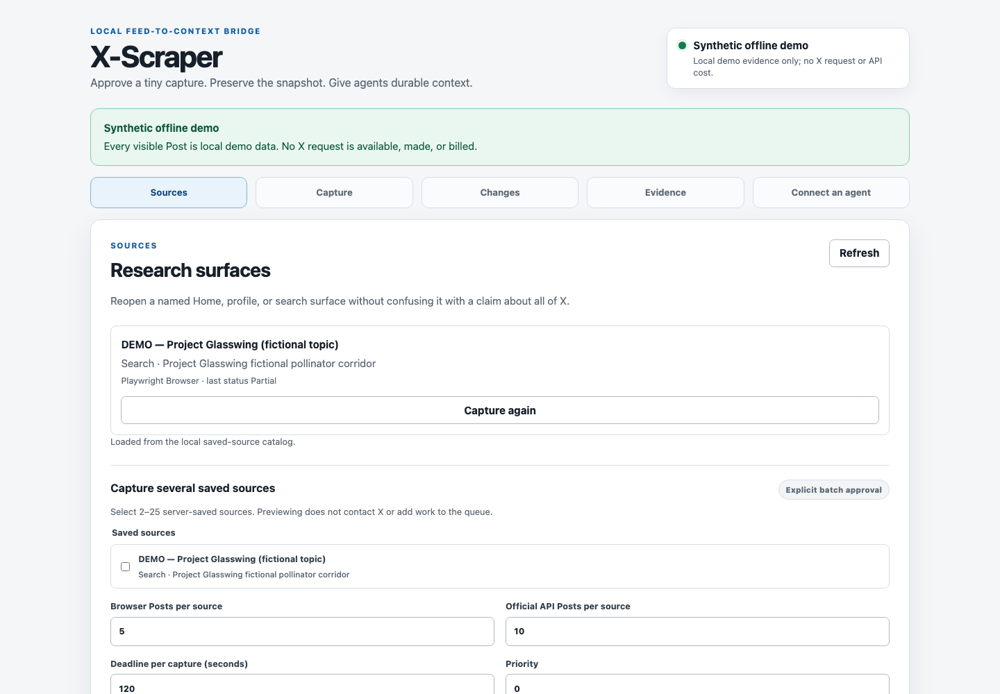
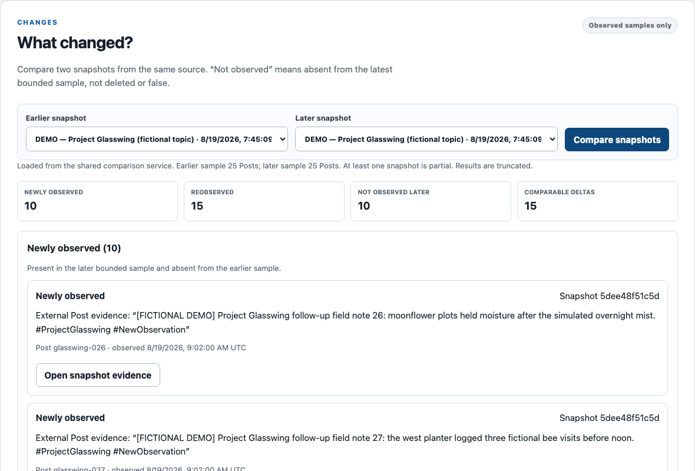

# Offline demo and recording storyboard

## Complete synthetic product loop

```bash
xworkbench demo
```

The command creates a temporary schema-v4 database and one saved source named
`DEMO — Project Glasswing (fictional topic)`. It seeds two compatible immutable snapshots with 25
Posts each:

- baseline: fictional Posts 1-25, complete;
- follow-up: Posts 11-35, deliberately partial and truncated.

All text, authors, metrics, timestamps, and `offline://` URLs are deterministic synthetic data. The
overlap gives 15 reobserved Posts, 10 newly observed Posts, and 10 not observed in the newer bounded
sample. Comparable engagement fields have deterministic deltas; missing metrics stay missing.

Before serving the dashboard, `demo` verifies the same-source Changes result, literal local
`moonflower` search, 25-row JSON and CSV exports, and a real direct-SQLite MCP
`compare_snapshots` call with all 12 tools registered. It prints only synthetic counts and local
routes. Collection is disabled and no provider is registered. Only the local dashboard uses
loopback HTTP; no external network read occurs. The temporary database persists for the process
lifetime and is removed after Ctrl+C.

In the UI, open the fictional source, compare the two snapshots, inspect evidence/sample caveats,
search, and export. Synthetic `offline://` evidence intentionally has no clickable original-X
citation; cite its stable evidence/snapshot/Post IDs instead.

The automated proof is `tests/test_offline_demo.py`. This demo proves the local product loop, not a
live X request, current X DOM, external MCP-client registration, or permission.

The following sanitized captures were rendered directly from that offline demo. They contain only
fictional data and local UI state.





## Sanitized 38-second storyboard

Frame a 1440x900 desktop capture, crop account/system identifiers, keep the pointer deliberate, and
use only the fictional demo except for the separately authorized headed-browser shot. Never show
credentials, cookies, live Post text, a token, storage state, the database path, notifications, or a
real username.

| Time | Shot and exact action | Gate before recording |
| --- | --- | --- |
| 0-4s | Title card, then readiness panel with local database, Chromium, and MCP checks green | Readiness UI must expose the proven checks |
| 4-8s | Select a saved source, show the small exact budget, click Preview, then Approve | Use an authorized owner run; demo collection is intentionally disabled |
| 8-12s | Brief headed Chromium frame with the content region masked; caption “Manual, bounded capture” | Authorized owner live gate must pass; never substitute fake live footage |
| 12-18s | Return to progress: scans, stored Posts, duplicates, field coverage, and stop reason settle | Owner run must retain only sanitized telemetry |
| 18-24s | Switch to Project Glasswing Changes; highlight new and reobserved evidence with IDs | Implemented and proven offline |
| 24-30s | In a verified MCP client ask “What changed?”; show the answer citing evidence/snapshot/Post IDs | External client setup must pass end to end; internal MCP read is already proven |
| 30-34s | Click JSON, then CSV export; show only sanitized filenames and success state | Implemented and proven offline |
| 34-38s | End card: **Captured once. Analyzed locally. No repeat X request.** | All prior recording gates green |

Record at normal speed with reduced-motion mode respected. Use one clear cut between the dashboard,
headed browser, and agent; never accelerate a wait so it looks like a result already existed. The
browser shot must be an authorized real run with content masked after capture, or omitted. A local
fixture must be labeled “sanitized local simulation,” never presented as live X.

Export the GIF only after a frame-by-frame secret/content review. Until the owner and external-
client gates pass, README keeps a text insertion point and no image link.
